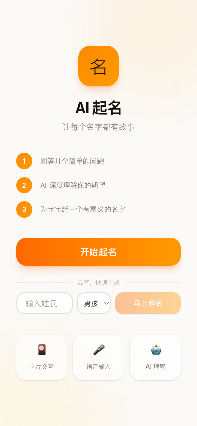
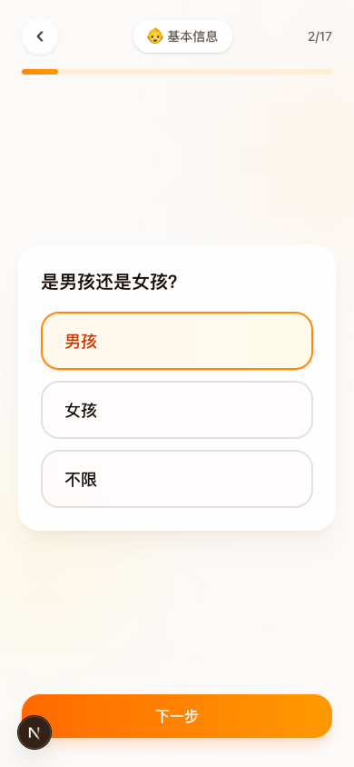
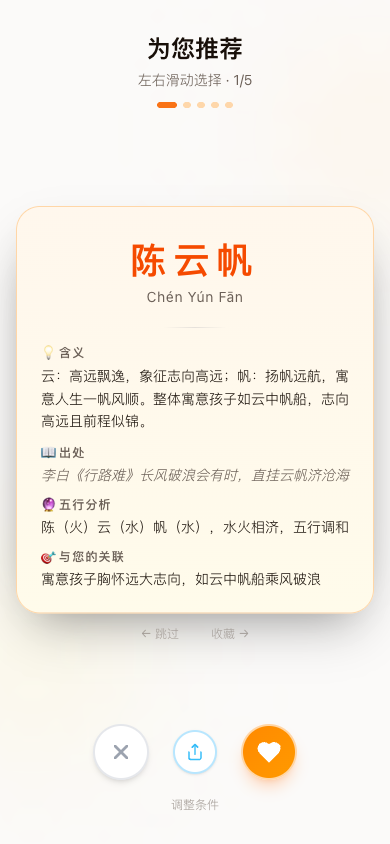

# AI 起名 - 让每个名字都有故事

基于 AI 的中文宝宝起名工具。通过卡片式交互收集用户偏好，利用大语言模型生成有文化内涵的名字。

**线上地址**: [https://name-agent.vercel.app](https://name-agent.vercel.app)

## 产品截图

<p align="center">
  
  
  
  
</p>

<p align="center">
  
  
  
</p>

## 核心特性

- **卡片式交互** - 17 张卡片覆盖 6 个维度（基本信息、期望寓意、家族信息、文化偏好、生活背景、自由补充），逐步收集用户偏好
- **探探风格滑动** - 结果页采用 Tinder/探探式左右滑动卡片，右划收藏、左划跳过
- **语音输入** - 所有卡片均支持语音输入，基于智谱 GLM-ASR 语音识别 API
- **快速起名** - 首页输入姓氏即可直接跳到 AI 生成，无需走完整卡片流程
- **AI 生成** - 调用智谱 GLM-4 大模型，结合用户上下文生成 5 个有文化内涵的名字
- **移动端优先** - 针对手机端设计，暖色调 UI、毛玻璃卡片、流畅动画

## 技术栈

| 类别 | 技术 |
|------|------|
| 框架 | Next.js 16 (App Router) + TypeScript |
| 样式 | TailwindCSS 4 + Shadcn/UI |
| 动画 | Framer Motion |
| 状态管理 | Zustand |
| AI 模型 | 智谱 GLM-4 (OpenAI 兼容接口) |
| 语音识别 | 智谱 GLM-ASR + MediaRecorder API |
| 数据库 | Supabase (PostgreSQL) |
| 部署 | Vercel |

## 项目结构

```
name-agent/
├── app/
│   ├── page.tsx                  # 首页（开始起名 + 快速生成）
│   ├── layout.tsx                # 根布局
│   ├── globals.css               # 全局样式 + 暖色主题
│   ├── flow/page.tsx             # 卡片交互流程页
│   ├── result/page.tsx           # 结果页（探探式滑动卡片）
│   └── api/
│       ├── generate/route.ts     # AI 起名 API
│       └── transcribe/route.ts   # 语音转文字 API
├── components/
│   ├── VoiceButton.tsx           # 通用语音按钮组件
│   ├── cards/
│   │   ├── CardStack.tsx         # 卡片流程容器（进度条、导航）
│   │   ├── TextInputCard.tsx     # 文本输入卡片
│   │   ├── SelectCard.tsx        # 单选卡片
│   │   ├── MultiSelectCard.tsx   # 多选卡片
│   │   ├── SliderCard.tsx        # 滑块卡片
│   │   ├── DatePickerCard.tsx    # 日期选择卡片
│   │   └── VoiceInputCard.tsx    # 语音输入卡片
│   └── ui/                       # Shadcn/UI 组件
├── hooks/
│   └── useVoiceInput.ts          # 语音录制 + ASR Hook
├── stores/
│   └── flow-store.ts             # Zustand 全局状态
├── lib/
│   ├── types.ts                  # TypeScript 类型定义
│   ├── cards-config.ts           # 17 张卡片配置
│   ├── voice-parser.ts           # 语音文本 → 选项匹配
│   ├── utils.ts                  # 工具函数
│   └── ai/
│       ├── client.ts             # 智谱 AI 客户端
│       └── prompt.ts             # Prompt 构建
└── public/screenshots/           # 产品截图
```

## 快速开始

### 环境要求

- Node.js 18+
- 智谱 AI API Key ([获取地址](https://open.bigmodel.cn))

### 本地运行

```bash
# 克隆项目
git clone https://github.com/ava-agent/name-agent.git
cd name-agent

# 安装依赖
npm install

# 配置环境变量
cp .env.local.example .env.local
# 编辑 .env.local，填入你的 API Key

# 启动开发服务器
npm run dev
```

### 环境变量

| 变量名 | 说明 |
|--------|------|
| `ZHIPU_API_KEY` | 智谱 AI API Key（必填） |
| `NEXT_PUBLIC_SUPABASE_URL` | Supabase 项目 URL（可选） |
| `NEXT_PUBLIC_SUPABASE_ANON_KEY` | Supabase 匿名 Key（可选） |

## 用户流程

1. **首页** - 点击「开始起名」进入完整流程，或输入姓氏点击「马上起名」快速生成
2. **卡片交互** - 依次回答 17 个问题（可跳过非必填项），支持语音和手动输入
3. **AI 生成** - 提交后 AI 根据所有上下文信息生成 5 个推荐名字
4. **滑动选名** - 左右滑动浏览名字，右划收藏、左划跳过
5. **结果汇总** - 浏览完毕后查看收藏列表，可「换一批」重新生成

## License

MIT
