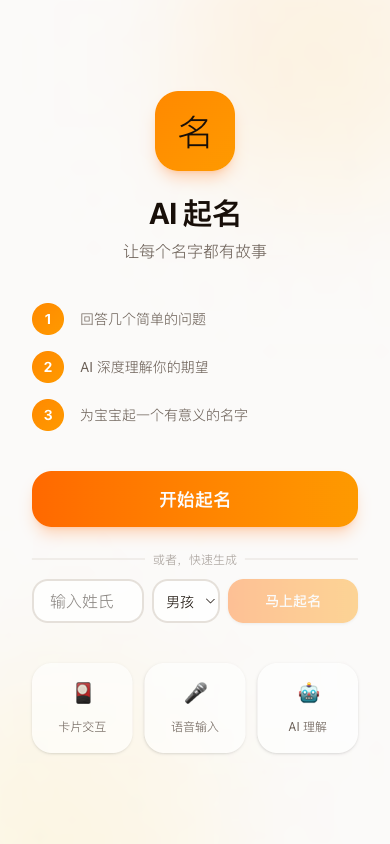
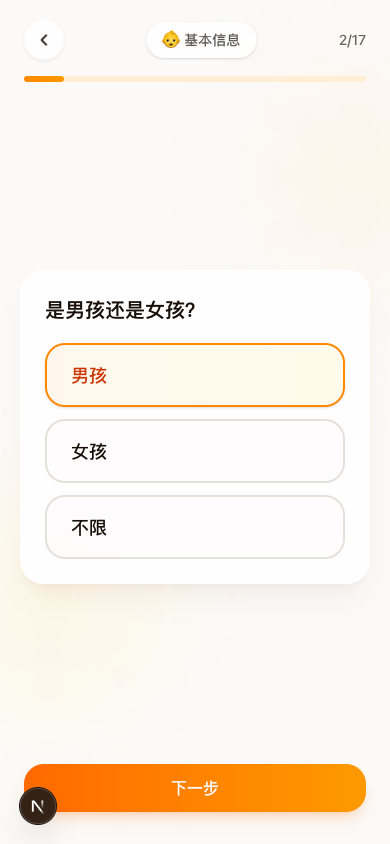
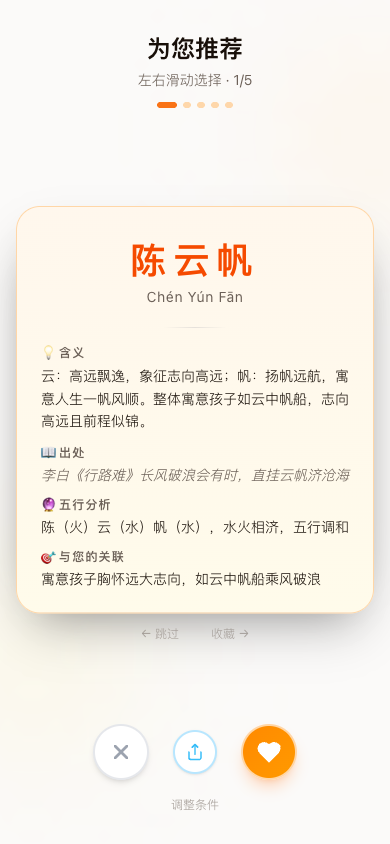
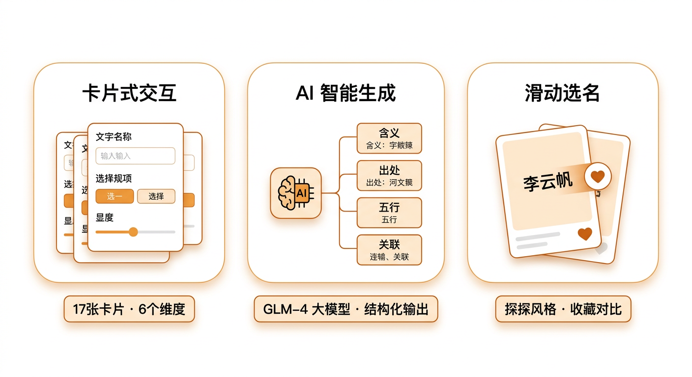
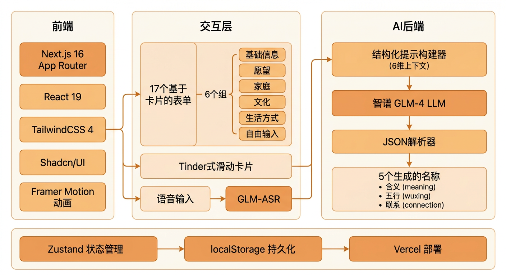
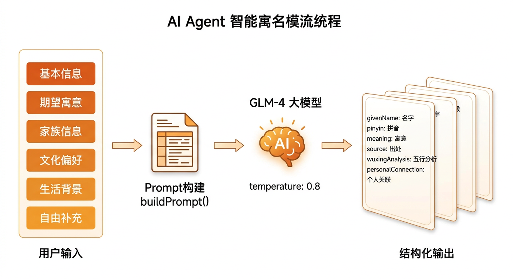
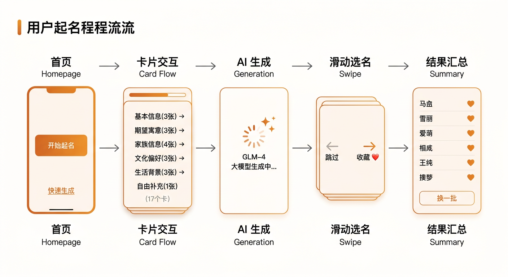
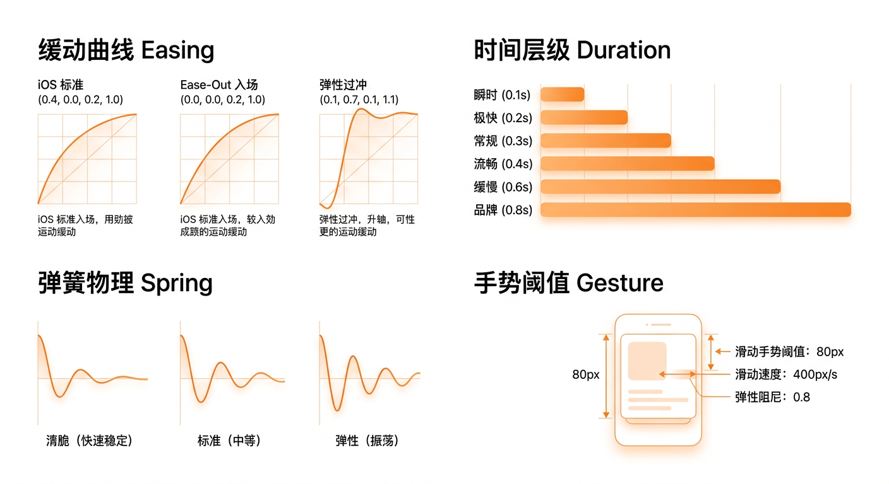

<p align="center">
  
</p>

<h1 align="center">AI 起名 - 让每个名字都有故事</h1>

<p align="center">
  基于 AI Agent 的中文宝宝起名工具。通过 17 张卡片式交互收集 6 维用户偏好，结合大语言模型生成有文化内涵的名字，探探式滑动选名。
</p>

<p align="center">
  <a href="https://name.rxcloud.group"><strong>在线体验 →</strong></a>
</p>

## 产品截图

<p align="center">
  
  
  
  
</p>

<p align="center">
  
  
  
</p>

## 核心特性

<p align="center">
  
</p>

- **卡片式交互** - 17 张卡片覆盖 6 个维度（基本信息、期望寓意、家族信息、文化偏好、生活背景、自由补充），渐进式收集用户偏好
- **探探风格滑动** - 结果页采用 Tinder/探探式左右滑动卡片，右划收藏、左划跳过
- **语音输入** - 文本输入卡片和自由补充支持语音输入，基于智谱 GLM-ASR 语音识别
- **快速起名** - 首页输入姓氏 + 选择性别即可直接跳到 AI 生成，无需走完整卡片流程
- **AI 生成** - 调用智谱 GLM-4 大模型，结合 6 维用户上下文生成 5 个有文化内涵的名字
- **Apple 风格动效** - 完整的运动设计系统：iOS 缓动曲线、弹簧物理、交错入场、手势反馈
- **移动端优先** - 针对手机端设计，暖色调 UI、毛玻璃卡片、流畅动画

## 技术架构

<p align="center">
  
</p>

## AI Agent 实现

<p align="center">
  
</p>

### Prompt 工程

系统采用结构化 Prompt 构建方案，将 17 张卡片的用户输入整合为 6 维上下文：

| 维度 | 信息 | 用途 |
|------|------|------|
| 基本信息 | 姓氏、性别、出生日期/时辰 | 基础约束 + 八字五行分析 |
| 期望寓意 | 性格特质、人生愿景、风格偏好 | 名字风格和寓意方向 |
| 家族信息 | 父母名字、辈分字、避讳字 | 避免重复 + 传承要求 |
| 文化偏好 | 五行属性、字数、发音偏好 | 文化约束条件 |
| 生活背景 | 爱好、居住地、已有名字 | 个性化关联 |
| 自由补充 | 语音/文字自由输入 | 额外上下文信息 |

### 生成输出

每个名字包含 6 个维度的结构化输出：

```json
{
  "givenName": "名字",
  "pinyin": "完整拼音（含声调）",
  "meaning": "含义解释（每个字的含义和整体寓意）",
  "source": "诗词典故出处",
  "wuxingAnalysis": "五行分析（每个字的五行属性及组合关系）",
  "personalConnection": "与用户上下文的个人关联"
}
```

### 语音识别

通过 MediaRecorder API 录制音频，调用智谱 GLM-ASR 进行语音转文字，支持 webm/mp4/ogg/wav 多种格式自动检测。

## 用户流程

<p align="center">
  
</p>

1. **首页** - 点击「开始起名」进入完整流程，或输入姓氏 + 选择性别「马上起名」快速生成
2. **卡片交互** - 依次回答 17 个问题（可跳过非必填项），文本输入支持语音
3. **AI 生成** - 提交后 AI 根据 6 维上下文信息生成 5 个推荐名字
4. **滑动选名** - 左右滑动浏览名字，右划收藏、左划跳过
5. **结果汇总** - 浏览完毕后查看收藏列表，可「换一批」重新生成

## 交互设计系统

<p align="center">
  
</p>

基于 Apple 设计理念构建的运动设计系统（`lib/motion.ts`），四大核心原则：

1. **物理真实感** - 基于弹簧动画（Spring Physics），模拟真实物理运动
2. **层次分明** - 页面元素按优先级依次入场（Stagger Animation）
3. **即时反馈** - 点击/触摸立即响应，无感知延迟（100ms 内）
4. **含蓄优雅** - 动画服务于功能，不喧宾夺主

### 参数规格

| 类别 | 参数 | 说明 |
|------|------|------|
| 缓动曲线 | `iOS [0.25, 0.1, 0.25, 1]` | 标准 UI 交互 |
| | `bouncy [0.34, 1.56, 0.64, 1]` | 强调性动画（过冲效果） |
| 持续时间 | `instant 0.1s` | 按钮点击、开关切换 |
| | `standard 0.3s` | 卡片展开、模态框 |
| | `brand 0.8s` | Logo 动画、首次加载 |
| 弹簧配置 | `snappy { stiffness: 400, damping: 30 }` | 小型 UI 元素 |
| | `bouncy { stiffness: 400, damping: 15 }` | 成功反馈 |
| 手势 | `swipeThreshold 80px` | 滑动触发阈值 |
| | `velocityThreshold 400px/s` | 速度触发阈值 |

## 技术栈

| 类别 | 技术 |
|------|------|
| 框架 | Next.js 16 (App Router) + TypeScript |
| 样式 | TailwindCSS 4 + Shadcn/UI |
| 动画 | Framer Motion + 自定义运动设计系统 |
| 状态管理 | Zustand |
| AI 模型 | 智谱 GLM-4 (OpenAI 兼容接口) |
| 语音识别 | 智谱 GLM-ASR + MediaRecorder API |
| 部署 | Vercel |

## 项目结构

```
name-agent/
├── app/
│   ├── page.tsx                  # 首页（开始起名 + 快速生成）
│   ├── layout.tsx                # 根布局
│   ├── globals.css               # 全局样式 + 动画变量 + 暖色主题
│   ├── flow/page.tsx             # 卡片交互流程页
│   ├── result/page.tsx           # 结果页（探探式滑动卡片）
│   └── api/
│       ├── generate/route.ts     # AI 起名 API（GLM-4）
│       └── transcribe/route.ts   # 语音转文字 API（GLM-ASR）
├── components/
│   ├── VoiceButton.tsx           # 通用语音按钮组件
│   ├── cards/
│   │   ├── CardStack.tsx         # 卡片流程容器（进度条、导航、动画）
│   │   ├── TextInputCard.tsx     # 文本输入卡片（带语音）
│   │   ├── SelectCard.tsx        # 单选卡片（弹簧动画）
│   │   ├── MultiSelectCard.tsx   # 多选卡片（交错入场）
│   │   ├── SliderCard.tsx        # 滑块卡片
│   │   ├── DatePickerCard.tsx    # 日期选择卡片（带时辰）
│   │   └── VoiceInputCard.tsx    # 语音输入卡片
│   └── ui/                       # Shadcn/UI 组件
├── hooks/
│   └── useVoiceInput.ts          # 语音录制 + ASR Hook
├── stores/
│   └── flow-store.ts             # Zustand 全局状态
├── lib/
│   ├── motion.ts                 # Apple 风格运动设计系统
│   ├── types.ts                  # TypeScript 类型定义
│   ├── cards-config.ts           # 17 张卡片配置（6 组）
│   ├── utils.ts                  # 工具函数
│   └── ai/
│       ├── client.ts             # 智谱 AI 客户端
│       └── prompt.ts             # 结构化 Prompt 构建
└── public/screenshots/           # 产品截图 + 架构图
```

## 快速开始

### 环境要求

- Node.js 18+
- 智谱 AI API Key ([获取地址](https://open.bigmodel.cn))

### 本地运行

```bash
# 克隆项目
git clone https://github.com/ava-agent/name-agent.git
cd name-agent

# 安装依赖
npm install

# 配置环境变量
cp .env.local.example .env.local
# 编辑 .env.local，填入你的 API Key

# 启动开发服务器
npm run dev
```

### 环境变量

| 变量名 | 说明 |
|--------|------|
| `ZHIPU_API_KEY` | 智谱 AI API Key（必填） |

## License

MIT
