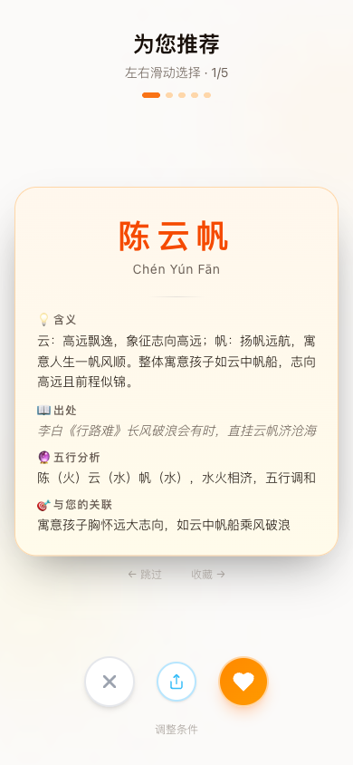
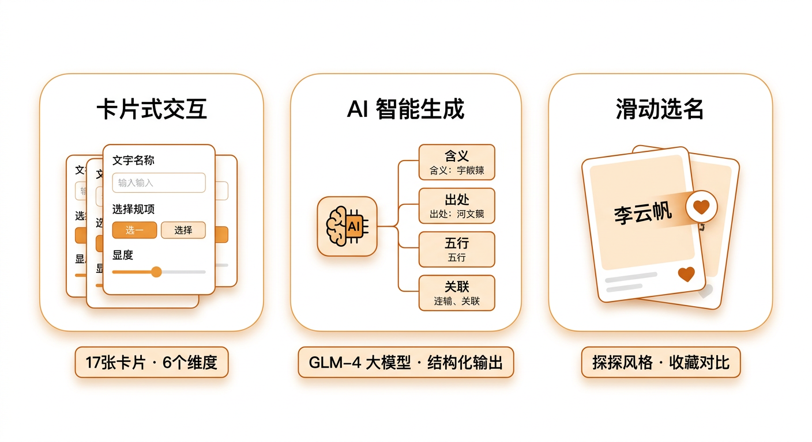
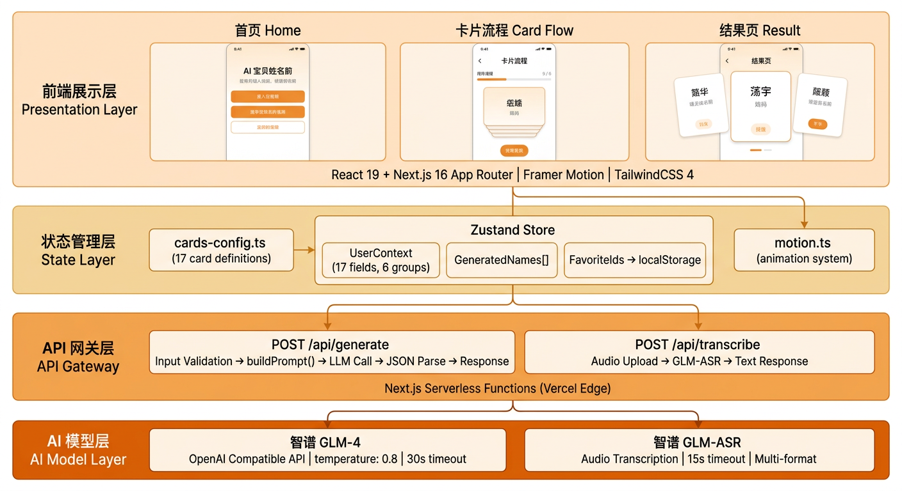
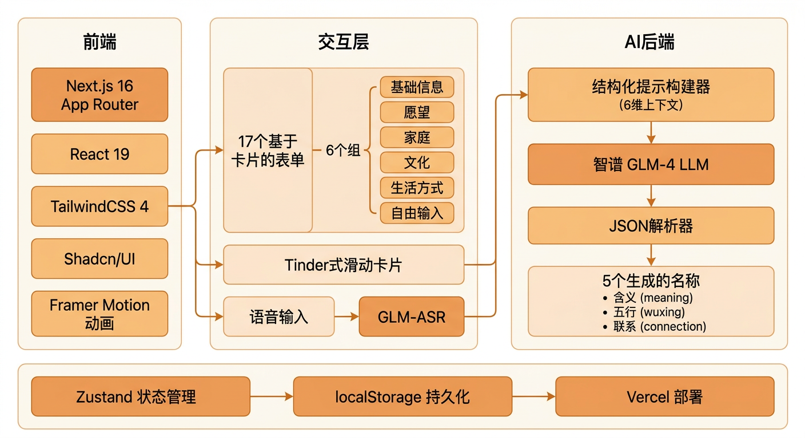
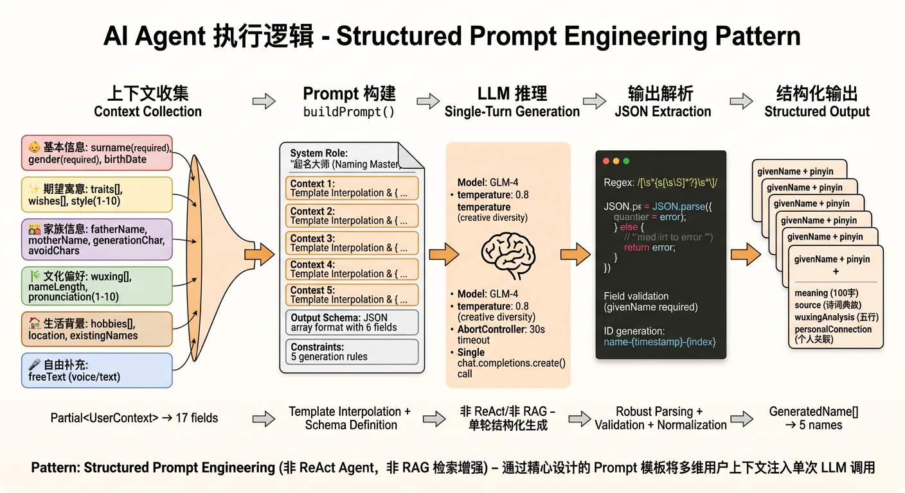
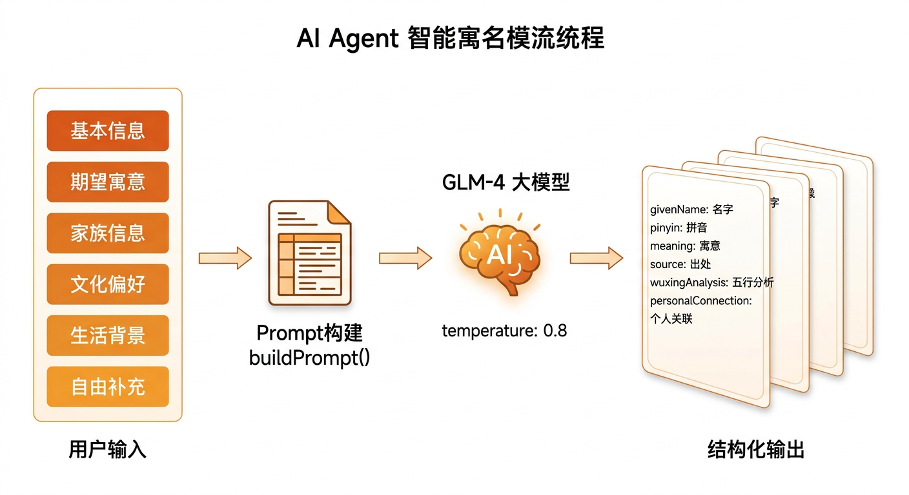
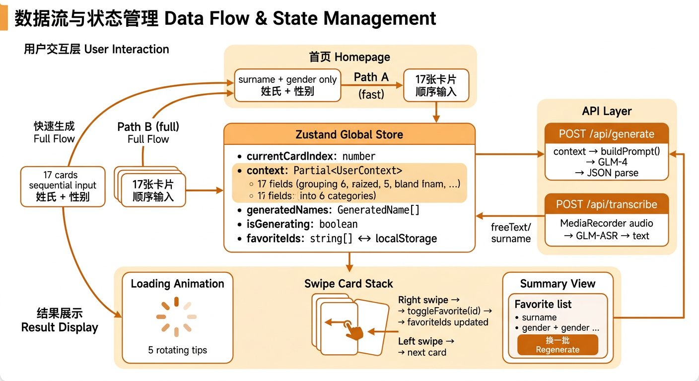
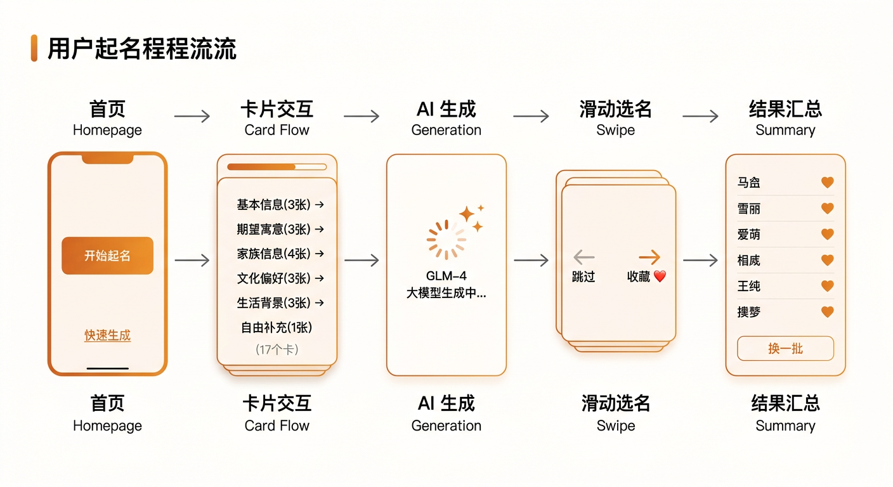
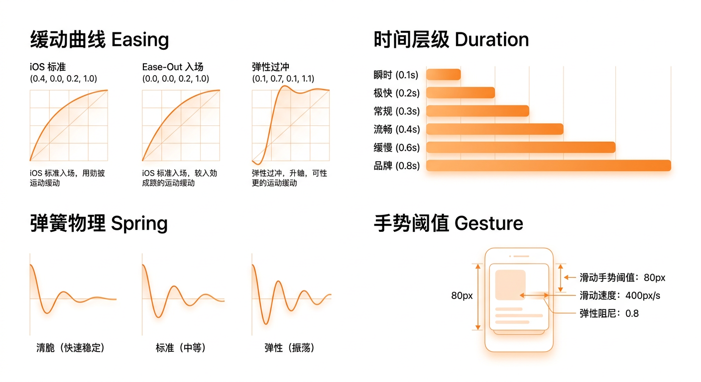

<p align="center">
  
</p>

<h1 align="center">AI 起名 - 让每个名字都有故事</h1>

<p align="center">
  基于 AI Agent 的中文宝宝起名工具。通过 17 张卡片式交互收集 6 维用户偏好，结合大语言模型生成有文化内涵的名字，探探式滑动选名。
</p>

<p align="center">
  <a href="https://name.rxcloud.group"><strong>在线体验 →</strong></a>
</p>

## 产品截图

<p align="center">
  
  
  
  
</p>

<p align="center">
  
  
  
</p>

## 核心特性

<p align="center">
  
</p>

- **卡片式交互** - 17 张卡片覆盖 6 个维度（基本信息、期望寓意、家族信息、文化偏好、生活背景、自由补充），渐进式收集用户偏好
- **探探风格滑动** - 结果页采用 Tinder/探探式左右滑动卡片，右划收藏、左划跳过
- **自由补充** - 支持通过文字补充故事、回忆和特别期望，作为起名上下文
- **快速起名** - 首页输入姓氏 + 选择性别即可直接跳到 AI 生成，无需走完整卡片流程
- **AI 生成** - 调用火山引擎 Ark CodingPlan 模型，结合 6 维用户上下文生成 5 个有文化内涵的名字
- **Apple 风格动效** - 完整的运动设计系统：iOS 缓动曲线、弹簧物理、交错入场、手势反馈
- **移动端优先** - 针对手机端设计，暖色调 UI、毛玻璃卡片、流畅动画

## 技术架构

### 全栈分层架构

<p align="center">
  
</p>

系统采用四层架构设计：

| 层级 | 职责 | 核心技术 |
|------|------|----------|
| **前端展示层** | 首页、卡片流程、结果页三大视图 | React 19 + Next.js 16 App Router + Framer Motion |
| **状态管理层** | 全局状态、卡片配置、动画系统 | Zustand Store + localStorage 持久化 |
| **API 网关层** | AI 起名接口、语音转写占位接口 | Next.js Serverless Functions |
| **AI 模型层** | 文本生成 | 火山引擎 Ark CodingPlan (OpenAI 兼容接口) |

<details>
<summary>旧版概览图</summary>
<p align="center">
  
</p>
</details>

## AI Agent 实现

### 执行逻辑 — Structured Prompt Engineering

<p align="center">
  
</p>

本系统采用 **Structured Prompt Engineering** 模式（非 ReAct Agent，非 RAG 检索增强），通过精心设计的 Prompt 模板将多维用户上下文注入单次 LLM 调用：

```
上下文收集 → Prompt 构建 → 单轮 LLM 推理 → JSON 提取 → 结构化输出
```

**五阶段流水线：**

1. **上下文收集** — 17 张卡片收集 `Partial<UserContext>`（17 个字段，6 组分类）
2. **Prompt 构建** — `buildPrompt()` 将 6 维上下文通过模板插值注入结构化 Prompt，包含系统角色（"起名大师"）、6 段上下文、JSON Schema、5 条约束
3. **LLM 推理** — 单次调用 Ark CodingPlan 模型（temperature: 0.8 提高创造性，AbortController 55s 超时）
4. **输出解析** — 正则 `/\[\s*\{[\s\S]*?\}\s*\]/` 鲁棒提取 JSON，字段校验与归一化
5. **结构化输出** — 生成 5 个 `GeneratedName`，每个含 6 维结构化信息

### Prompt 工程

`buildPrompt()` 将 17 张卡片的用户输入整合为 6 维上下文：

| 维度 | 信息 | 用途 |
|------|------|------|
| 基本信息 | 姓氏、性别、出生日期/时辰 | 基础约束 + 八字五行分析 |
| 期望寓意 | 性格特质、人生愿景、风格偏好 | 名字风格和寓意方向 |
| 家族信息 | 父母名字、辈分字、避讳字 | 避免重复 + 传承要求 |
| 文化偏好 | 五行属性、字数、发音偏好 | 文化约束条件 |
| 生活背景 | 爱好、居住地、已有名字 | 个性化关联 |
| 自由补充 | 文字自由输入 | 额外上下文信息 |

### 生成输出

每个名字包含 6 个维度的结构化输出：

```json
{
  "givenName": "名字",
  "pinyin": "完整拼音（含声调）",
  "meaning": "含义解释（每个字的含义和整体寓意）",
  "source": "诗词典故出处",
  "wuxingAnalysis": "五行分析（每个字的五行属性及组合关系）",
  "personalConnection": "与用户上下文的个人关联"
}
```

### 语音转文字状态

旧语音识别服务已移除，当前默认关闭语音输入入口；`/api/transcribe` 会返回 501。后续接入火山引擎语音识别后，可通过 `NEXT_PUBLIC_VOICE_INPUT_ENABLED=true` 恢复前端入口。

<details>
<summary>旧版 AI Pipeline 概览图</summary>
<p align="center">
  
</p>
</details>

## 数据流与状态管理

<p align="center">
  
</p>

系统通过 Zustand 全局 Store 管理所有状态，支持两条用户路径：

- **Path A（完整流程）**：首页 → 17 张卡片顺序输入 → AI 生成 → 滑动选名 → 结果汇总
- **Path B（快速生成）**：首页输入姓氏 + 性别 → 直接跳到 AI 生成

核心状态：`currentCardIndex`、`context: Partial<UserContext>`（17 字段）、`generatedNames: GeneratedName[]`、`isGenerating`、`favoriteIds: string[]`（localStorage 持久化）

## 用户流程

<p align="center">
  
</p>

1. **首页** - 点击「开始起名」进入完整流程，或输入姓氏 + 选择性别「马上起名」快速生成
2. **卡片交互** - 依次回答 17 个问题（可跳过非必填项），并补充故事、回忆或特别期望
3. **AI 生成** - 提交后 AI 根据 6 维上下文信息生成 5 个推荐名字
4. **滑动选名** - 左右滑动浏览名字，右划收藏、左划跳过
5. **结果汇总** - 浏览完毕后查看收藏列表，可「换一批」重新生成

## 交互设计系统

<p align="center">
  
</p>

基于 Apple 设计理念构建的运动设计系统（`lib/motion.ts`），四大核心原则：

1. **物理真实感** - 基于弹簧动画（Spring Physics），模拟真实物理运动
2. **层次分明** - 页面元素按优先级依次入场（Stagger Animation）
3. **即时反馈** - 点击/触摸立即响应，无感知延迟（100ms 内）
4. **含蓄优雅** - 动画服务于功能，不喧宾夺主

### 参数规格

| 类别 | 参数 | 说明 |
|------|------|------|
| 缓动曲线 | `iOS [0.25, 0.1, 0.25, 1]` | 标准 UI 交互 |
| | `bouncy [0.34, 1.56, 0.64, 1]` | 强调性动画（过冲效果） |
| 持续时间 | `instant 0.1s` | 按钮点击、开关切换 |
| | `standard 0.3s` | 卡片展开、模态框 |
| | `brand 0.8s` | Logo 动画、首次加载 |
| 弹簧配置 | `snappy { stiffness: 400, damping: 30 }` | 小型 UI 元素 |
| | `bouncy { stiffness: 400, damping: 15 }` | 成功反馈 |
| 手势 | `swipeThreshold 80px` | 滑动触发阈值 |
| | `velocityThreshold 400px/s` | 速度触发阈值 |

## 技术栈

| 类别 | 技术 |
|------|------|
| 框架 | Next.js 16 (App Router) + TypeScript |
| 样式 | TailwindCSS 4 + Shadcn/UI |
| 动画 | Framer Motion + 自定义运动设计系统 |
| 状态管理 | Zustand |
| AI 模型 | 火山引擎 Ark CodingPlan (OpenAI 兼容接口) |
| 语音转文字 | 默认关闭，待接入火山引擎语音识别 |
| 部署 | Vercel |

## 项目结构

```
name-agent/
├── app/
│   ├── page.tsx                  # 首页（开始起名 + 快速生成）
│   ├── layout.tsx                # 根布局
│   ├── globals.css               # 全局样式 + 动画变量 + 暖色主题
│   ├── flow/page.tsx             # 卡片交互流程页
│   ├── result/page.tsx           # 结果页（探探式滑动卡片）
│   └── api/
│       ├── generate/route.ts     # AI 起名 API（Ark CodingPlan）
│       └── transcribe/route.ts   # 语音转文字占位接口（默认关闭）
├── components/
│   ├── VoiceButton.tsx           # 通用语音按钮组件
│   ├── cards/
│   │   ├── CardStack.tsx         # 卡片流程容器（进度条、导航、动画）
│   │   ├── TextInputCard.tsx     # 文本输入卡片
│   │   ├── SelectCard.tsx        # 单选卡片（弹簧动画）
│   │   ├── MultiSelectCard.tsx   # 多选卡片（交错入场）
│   │   ├── SliderCard.tsx        # 滑块卡片
│   │   ├── DatePickerCard.tsx    # 日期选择卡片（带时辰）
│   │   └── VoiceInputCard.tsx    # 语音输入卡片
│   └── ui/                       # Shadcn/UI 组件
├── hooks/
│   └── useVoiceInput.ts          # 语音录制 Hook（默认关闭）
├── stores/
│   └── flow-store.ts             # Zustand 全局状态
├── lib/
│   ├── motion.ts                 # Apple 风格运动设计系统
│   ├── types.ts                  # TypeScript 类型定义
│   ├── cards-config.ts           # 17 张卡片配置（6 组）
│   ├── utils.ts                  # 工具函数
│   └── ai/
│       ├── client.ts             # Ark OpenAI 兼容客户端
│       └── prompt.ts             # 结构化 Prompt 构建
└── public/screenshots/           # 产品截图 + 架构图
```

## 快速开始

### 环境要求

- Node.js 18+
- 火山引擎 Ark CodingPlan API Key

### 本地运行

```bash
# 克隆项目
git clone https://github.com/ava-agent/name-agent.git
cd name-agent

# 安装依赖
npm install

# 配置环境变量
cp .env.local.example .env.local
# 编辑 .env.local，填入 Ark API Key

# 启动开发服务器
npm run dev
```

### 环境变量

| 变量名 | 说明 |
|--------|------|
| `ARK_API_KEY` | 火山引擎 Ark API Key（必填） |
| `ARK_BASE_URL` | Ark OpenAI 兼容接口地址，默认 `https://ark.cn-beijing.volces.com/api/coding/v3` |
| `ARK_CHAT_MODEL` | Ark CodingPlan 模型，默认 `doubao-seed-2-0-code-preview-260215` |
| `NEXT_PUBLIC_VOICE_INPUT_ENABLED` | 是否启用语音输入入口，默认 `false` |
| `NEXT_PUBLIC_SUPABASE_URL` | Supabase 项目 URL（可选，预留浏览器端配置） |
| `NEXT_PUBLIC_SUPABASE_ANON_KEY` | Supabase anonymous key（可选，预留浏览器端配置） |

## 验证命令

```bash
npm run lint
npm run type-check
npm run test
npm run build
```

- `npm run test` 当前执行 lint + TypeScript 类型检查，作为功能开发前后的快速质量门。
- `npm run build` 用于部署前验证 Next.js 生产构建。

## 部署说明

详细部署步骤见 [`DEPLOYMENT.md`](DEPLOYMENT.md)。

### Vercel

- Production URL: `https://name.rxcloud.group`
- Framework Preset: Next.js
- Build Command: `npm run build`
- Output: Vercel 自动识别 Next.js 输出
- Required Environment Variables:
  - `ARK_API_KEY`
  - `ARK_BASE_URL`
  - `ARK_CHAT_MODEL`
- Optional Environment Variables:
  - `NEXT_PUBLIC_VOICE_INPUT_ENABLED=false`
  - `NEXT_PUBLIC_SUPABASE_URL`
  - `NEXT_PUBLIC_SUPABASE_ANON_KEY`

部署前确认:

1. `.env.local` 只保留在本地，不提交。
2. Vercel 项目环境变量已配置 `ARK_API_KEY`、`ARK_BASE_URL` 和 `ARK_CHAT_MODEL`。
3. `npm run test` 和 `npm run build` 均通过。

## License

MIT
